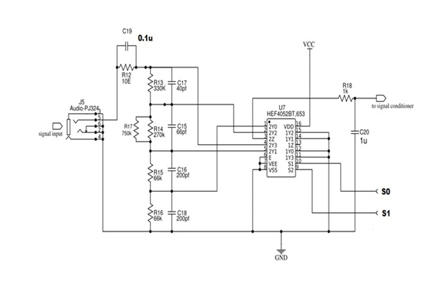
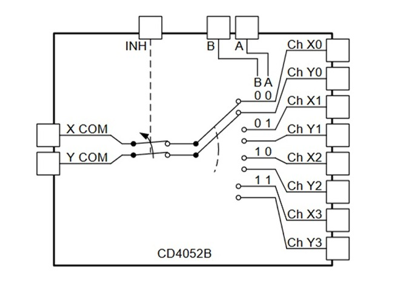
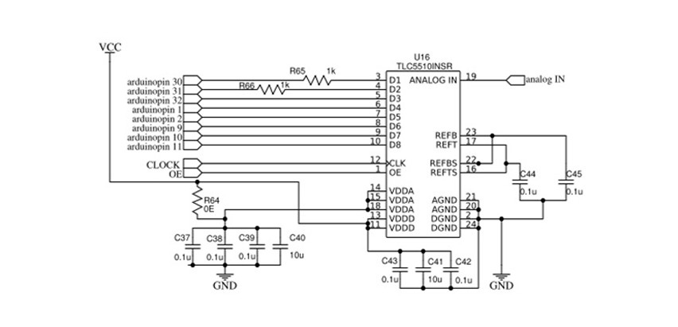
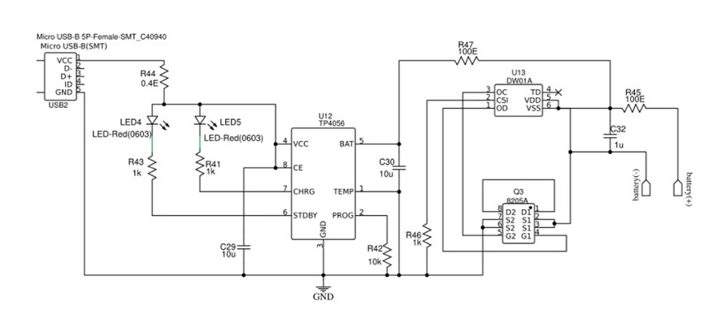
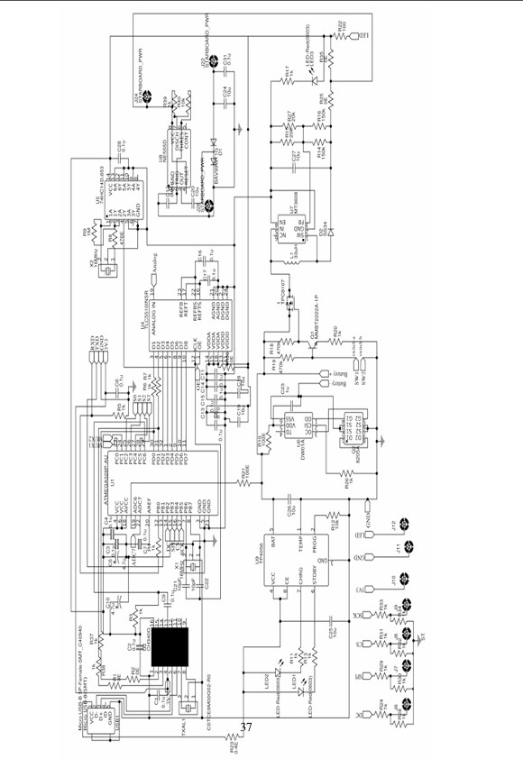

# SIGNAL-VISUALIZER
Signal Visualizer is a compact, portable signal analysis device featuring a protected front-end attenuator, high-speed ADC for precise waveform capture, and an ATmega328 processing core. It includes a full-color display, intelligent battery management, onboard USB reprogramming, and an all-SMD design for enhanced portability and reliability.

<h3>Signal Visualizer</h3>

# BLOCK DIAGRAM
Overall, the design consist of a front end, which includes an attenuator accompanied by a signal
conditioner. Then follows the ADC part which samples the analog input. The next part is the
heart of the design, the controller of the arduino (ATMEGA 328), which processes the sampled
data. Next is the TFT screen which displays the processed output from the controller. In
addition to that a power supply unit consisting of adequate circuitry to provide specific power
to different components in the device is also employed.

# ATTENUATOR
The attenuator block is the main part of the front end design of the scope. The attenuator section
consists of mainly two parts. 

## Key Analog Blocks

- The Compensated Attenuator Ladder  
- Analog Multiplexer

## Analog Front-End Architecture

### 1️⃣ Compensated Attenuator Ladder

The compensated attenuator ladder forms the primary voltage attenuation stage of the system.  
It scales a wide range of random input signal voltages to a safe operational level for the device.

- Input Voltage Range: 0 V to 10 V  
- Purpose: Protect internal circuitry from overvoltage  
- Design: Frequency-compensated potential divider network  

To maintain signal integrity across a wide frequency range, the attenuator uses a frequency-compensated potential divider arrangement, preventing distortion at higher frequencies.

---

### 2️⃣ Frequency Compensated Potential Divider

A frequency-compensated potential divider is a two-port RC network designed to maintain a constant voltage division ratio across a broad frequency spectrum.

#### Working Principle:

- At low frequencies:
  - Resistors act as the voltage divider.
- At high frequencies:
  - Parallel capacitors dominate the division ratio.
  - This compensates for parasitic capacitance of resistors.

#### Design Features:

- Capacitors connected in parallel with each resistor.
- Reduces frequency-dependent attenuation errors.
- Ensures flat frequency response.

A typical compensated divider schematic is shown below:

  

---

### 3️⃣ Analog Multiplexer

The analog multiplexer is used to digitally select which attenuated analog signal is routed for further processing.

#### Key Characteristics:

- Wideband 4:1 analog multiplexer
- Controlled by 2-bit binary input
- Digital switching of analog signals
- Selects required attenuated input channel

#### Function:

- Receives multiple attenuated signals
- Outputs selected signal to the processing stage

Schematic representation:

  

## Signal Conditioning and Processing Architecture

---

## 1️⃣ Signal Conditioner

The Signal Conditioner stage provides high input impedance and low output impedance to prevent loading effects on the ADC.

After attenuation, the signal experiences power loss. This stage restores signal strength while preserving waveform integrity.

### Functional Objectives

- Provide high input impedance
- Provide low output impedance
- Prevent ADC loading effects
- Enable DC level shifting
- Provide overvoltage protection

### Design Implementation

- Operational amplifier in unity gain configuration
- Op-amp used: NJM4565
- 

### Key Specifications of NJM4565

- High gain
- Wide bandwidth: 4 MHz
- Slew rate: 4 V/µs
- Capable of driving 20 Vpp into 400 Ω loads

### Protection Mechanism

The op-amp operates with a 3 V supply.  
If input exceeds this range, output saturates at 3 V, protecting subsequent circuits.

---

## 2️⃣ Analog to Digital Converter (ADC)

The built-in Arduino ADC has low sampling rate, which results in poor waveform quality.

To overcome this limitation, a high-speed external ADC is used.

### ADC Used

- TLC5510

### Features

- Sampling rate: 10 MSPS to 15 MSPS
- 8-bit parallel data output
- Full-scale input voltage: 2 V
- Single supply operation

This significantly improves waveform resolution and display accuracy.

---

## 3️⃣ Processing Unit – ATmega328P

The ATmega328P acts as the central processing unit.

### Functional Roles

- Receives digital data from ADC
- Stores sampled data temporarily
- Processes waveform
- Drives TFT display
- Controls analog multiplexer switching

### Specifications

- 8-bit AVR RISC microcontroller
- 32 KB Flash memory
- 2 KB SRAM
- 32 pins (8 analog, 14 digital)
- External 16 MHz crystal clock

The ADC output (8-bit parallel) is connected directly to 8 input pins of the microcontroller.

---

## 4️⃣ Power Supply Section

The device is powered by a 3.7 V Lithium-ion cell.

### Power Blocks

- Boost Converter
- 555 Charge Pump
- 3.3 V Regulator

### Boost Converter (MT3608)

- Provides stable 5 V supply
- Switching frequency: 1.2 MHz
- Current mode step-up converter
- Internal soft start for reduced inrush current

### 555 Charge Pump

- Generates negative supply voltage
- Used for signal conditioner
- Simple voltage inversion method

### 3.3 V Regulator (HT7130)

- Low dropout linear regulator
- Supplies TFT display

All components are SMD variants to minimize size.

---

## 5️⃣ Battery Management System

The device uses a single 3.7 V Lithium-ion cell.

Due to safety risks, protection circuitry is essential.

### Functional Objectives

- Overcharge protection
- Over-discharge protection
- Overcurrent protection
- Short circuit protection
- Auto cut-off
- Charge status indication

### ICs Used

- TP4056 – Li-ion charge controller
- DW01A – Battery protection IC
- S8205A – Dual MOSFET protection switch

TP4056 provides CC/CV charging.  
DW01A detects fault conditions.  
S8205A disconnects battery during unsafe conditions.

---

## 6️⃣ USB Interface

The USB interface enables firmware updates.

### IC Used

- CH340

### Features

- USB to serial conversion
- Minimal external components
- Supports USB to UART interface

Allows reprogramming and system modification.

---

## 7️⃣ Display Module

The display is a 2.8-inch TFT LCD.

### Specifications

- Resolution: 240 × 320 pixels
- Full color LCD
- Controller IC: IL19341V
- Interface: 8/16-bit 8080 parallel MCU
- Portrait mode operation

---

## 8️⃣ ADC Clock Circuit

Clock generation is critical for proper sampling.

### Implementation

- IC used: 7414 Schmitt trigger NOT gate
- Crystal oscillator: 16 MHz
- 

The Schmitt trigger ensures stable oscillation and clean clock edges.

---

## 9️⃣ Program Flow

1. Import TFT display libraries  
2. Define serial communication pins  
3. Allocate pixel data array  
4. Configure ADC input pins  
5. Capture ADC data using iterative loop  
6. Store data in array  
7. Send waveform data to TFT  
8. Check control signals via switches  
9. Repeat continuously  

# FULL CIRCUIT DIAGRAM

## ACHIEVED SPECIFICATIONS AND OUTCOMES

The following performance metrics were achieved in the implemented design:

- Bandwidth: Up to 1 MHz  
- Waveform Support: Compatible with multiple waveform types  
- Input Voltage Range: 0 V to 10 V  
- Input Impedance: 0.5 MΩ  
- Sampling Rate: Up to 10 MSPS  
- Signal-to-Noise Ratio: High SNR performance  
- Resolution: 8-bit digital output  

